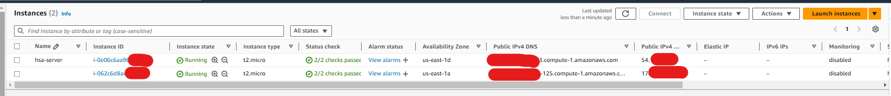
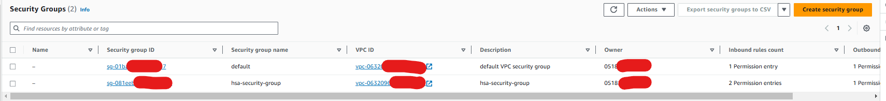
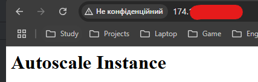
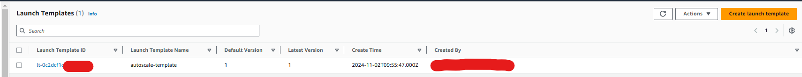
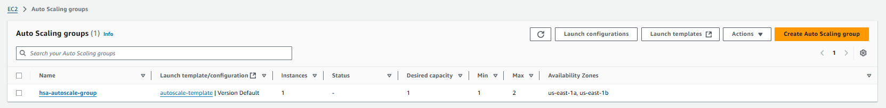
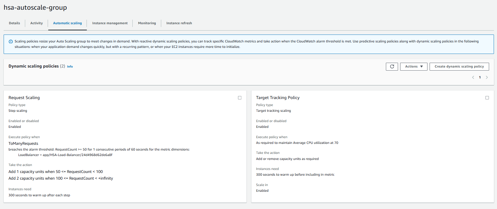
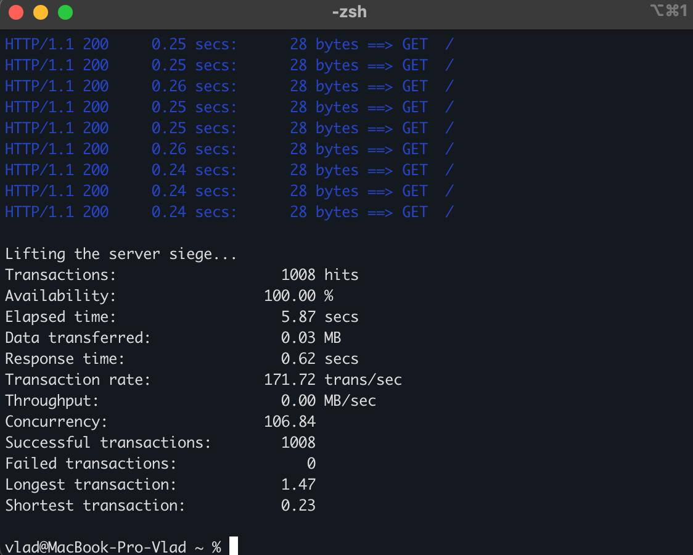
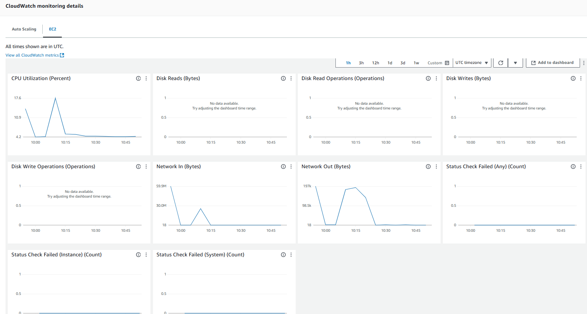
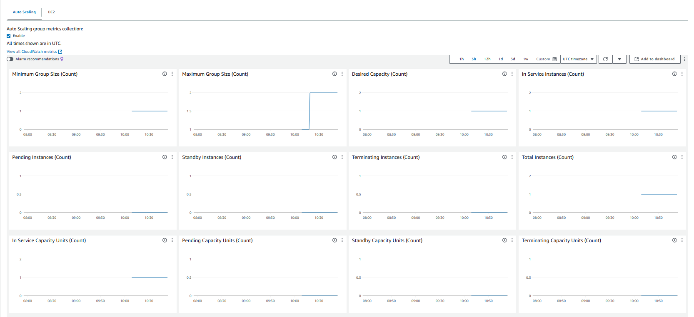
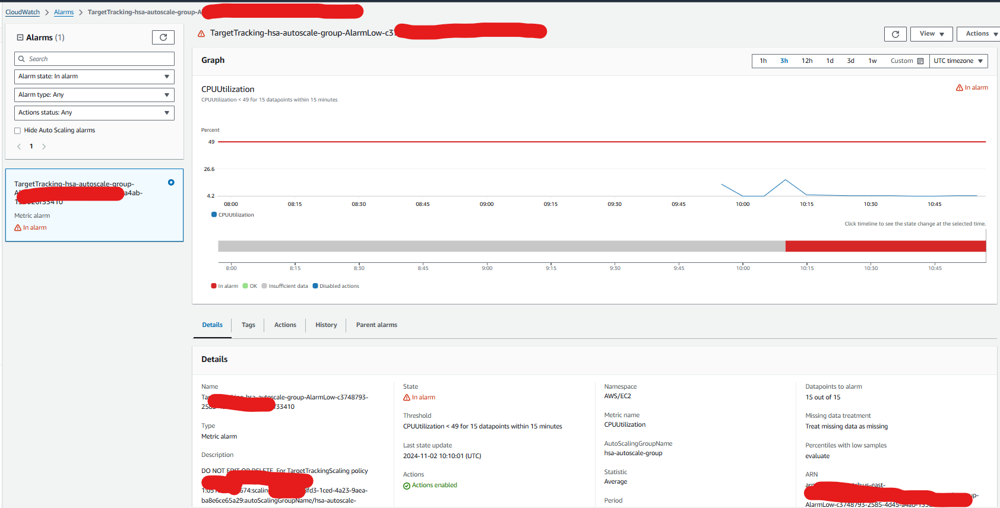

# AWS-Autoscale-groups

This guide provides step-by-step instructions to create an auto-scaling group on AWS. The group will contain one
on-demand instance and will automatically scale on spot instances based on average CPU usage and request count. The
setup includes installing a web server on the EC2 instance to simulate load for testing scaling policies.

## Prerequisites

- AWS account with permissions to create EC2 instances, Auto Scaling groups, and CloudWatch alarms.
- AWS CLI configured with necessary permissions.
- Key pair for SSH access to EC2 instances.

### 1. Create an EC2 Instance with Web Server

#### 1.1. Launch an EC2 Instance:

- Log in to the AWS Management Console.
- Go to EC2 > Launch Instance.
- Select an AMI (Amazon Linux 2 or Ubuntu 20.04 LTS recommended).
- Choose instance type t2.micro (or any on-demand instance type).
- Configure key pair, network, and storage as required.



#### 1.2. Configure Security Group:

- Create a new Security Group or use an existing one.
- Add inbound rules:
    - HTTP: Port 80, Source 0.0.0.0/0 (allows access to the web server).
    - SSH: Port 22, Source 0.0.0.0/0 (for SSH access; restrict to your IP if needed).



#### 1.3. Connect to the EC2 Instance:

- Use SSH to connect to the instance:

````bash
ssh -i /path/to/your-key.pem ec2-user@<PUBLIC_IP>
````

#### 1.4. Install a Web Server:

- Update the package list and install a web server.

```bash
sudo yum update -y
sudo yum install -y httpd
sudo systemctl start httpd
sudo systemctl enable httpd
echo "<h1>Autoscale Instance</h1>" | sudo tee /var/www/html/index.html
```

- Verify that the web server is running by visiting the instance's public IP address in a browser: http://<PUBLIC_IP>



### 2. Set Up an Auto Scaling Group

#### 2.1. Create Launch Template:

- Go to EC2 > Launch Templates > Create Launch Template.
- Provide a name and description.
- Under AMI ID, select the same AMI used for the initial instance.
- Choose the instance type (e.g., t2.micro).
- Under Network Settings, choose the VPC and subnet.
- Under Security Group, select the same security group configured for HTTP and SSH access.
- Save the template.



#### 2.2. Create Auto Scaling Group:

- Go to Auto Scaling Groups > Create Auto Scaling Group.
- Name the group and select the launch template created earlier.
- Set the Desired Capacity to 1, Minimum Capacity to 1, and Maximum Capacity to the desired maximum (e.g., 5).
- Choose the Instance purchase options as "Mixed instances" and select Spot as the additional instance type.
- Under Network, select the VPC and at least one subnet.
- Configure additional settings as required, then create the Auto Scaling Group.



### 3. Configure Scaling Policies

### Scaling Policy Based on CPU Usage

#### 3.1. Create CloudWatch Alarm for CPU Usage:

- Go to CloudWatch > Alarms > Create Alarm.
- Select EC2 as the metric namespace.
- Choose the Average CPU Utilization metric.
- Set the threshold for CPU usage (e.g., 60%).
- Configure actions to trigger the Auto Scaling Group to add instances when CPU usage exceeds the threshold.

#### 3.2. Attach Alarm to Auto Scaling Group:

- Go to Auto Scaling Groups > select your Auto Scaling Group > Automatic scaling > Add policy.
- Choose Target tracking policy.
- Select Average CPU Utilization as the metric.
- Set the target value (e.g., 60%) and save the policy.

### Scaling Policy Based on Request Count

#### 3.3. Create CloudWatch Alarm for Request Count:

- Go to CloudWatch > Alarms > Create Alarm.
- Choose ApplicationELB > RequestCount metric.
- Set the threshold for requests (e.g., 100 requests per minute).
- Configure actions to trigger scaling based on request count.

#### 3.4. Set Up Step Scaling:

- Go to Auto Scaling Groups > Automatic scaling > Add policy.
- Select Step scaling and attach the CloudWatch alarm created for requests.
- Set step actions, such as:
- Add 1 instance if requests are between 50 and 100.
- Add 2 instances if requests exceed 100.
- Save the policy.



### 4. Monitor and Test the Auto Scaling Group

#### 4.1. Create Load Test:

- Use a tool like siege to generate HTTP requests to the EC2 instance:

````bash
siege -c 100 -t 5M http://<PUBLIC_IP>
````

- Adjust the number of concurrent requests and test duration as needed.



#### 4.2. Monitor Auto Scaling Activity:

- Go to EC2 > Auto Scaling Groups > select your group > Activity.
- Check for scaling events that show instances being added or removed.

#### 4.3. Review CloudWatch Metrics:

- Go to CloudWatch > Metrics > Auto Scaling or EC2 to monitor CPU utilization, request count, and scaling events.

#### 4.4. Verify Scaling Behavior:

- Confirm that new instances are being added when CPU or request count thresholds are reached.
- Confirm that instances are being removed as the load decreases.



